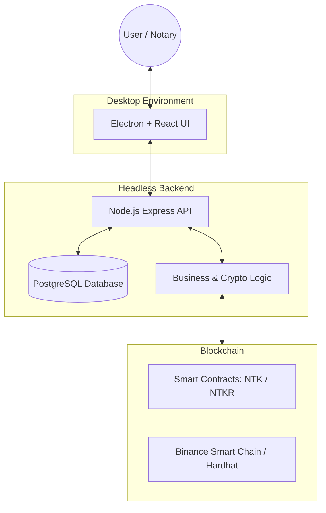
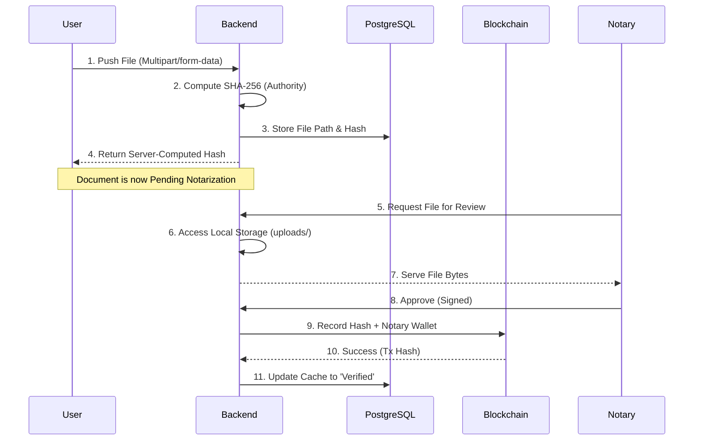
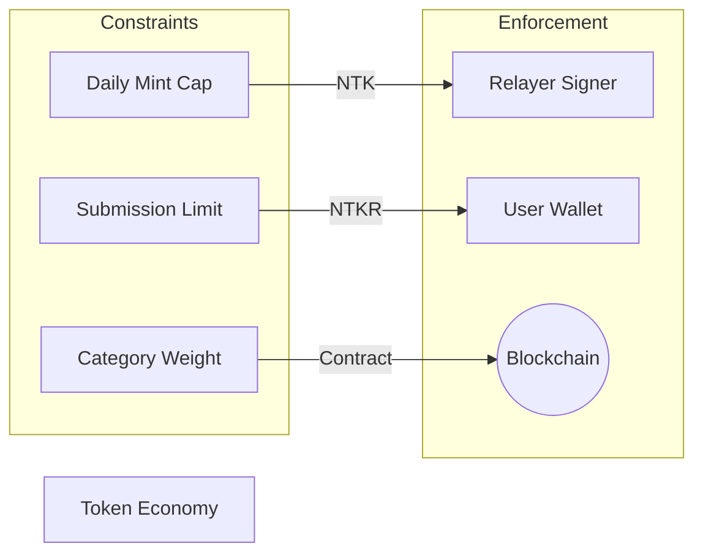

# BBSNS: System Architecture Deep-Dive

This document provides a comprehensive mapping of the BBSNS (Blockchain-Based Secure Notarization System) architecture, from high-level user flows to deep-seated cryptographic invariants.

---

## Layer 1: High-Level Architecture (The Big Picture)
**Perspective**: Strategic / Executive

The system follows a triple-point architecture: a single-window Client for interaction, a centralized Backend for orchestration and authoritative hashing, and a decentralized Blockchain for immutable proof.

---

## Layer 2: Component Architecture (The Tech Stack)
**Perspective**: Engineering / Implementation

| Category | Technology | Purpose |
| :--- | :--- | :--- |
| **Execution** | Electron | Manages the single-window desktop environment. |
| **Frontend** | React / Next.js | Provides a dynamic, glassmorphism-inspired UI. |
| **Backend** | Node.js (CommonJS) | Headless service managing all authoritative logic. |
| **Database** | PostgreSQL | Stores mutable state (Users, Metadata, Audit Logs). |
| **Hashing** | Crypto (SHA-256) | Generates authoritative document identities. |
| **Blockchain** | Solidity / Ethers.js | Final settlement and immutable state layer. |

---

## Layer 3: Information & Data Flow
**Perspective**: Functional / Data Integrity

We distinguish between **Primary Data** (the file) and **Cryptographic Metadata** (the hash). 

---

## Layer 4: Trust Architecture (Security Invariants)
**Perspective**: Auditing / Cybersecurity

This layer defines the **non-negotiable trust boundaries** of the system.

1.  **Hash Authority**: The Backend is the *only* source of truth for file hashes. The Frontend is restricted to sending bytes only.
2.  **Semantic Linkage**: The Notary fetches the actual stored file for review. This ensures the Notary approves exactly what the server hashed.
3.  **Role Integrity**: On-chain access is restricted to the `RELAYER_ROLE`. The backend cannot execute notarizations without satisfying contract-level rules.
4.  **Hard-Fail Safety**: Runtime flags like `DEV_MODE` are forbidden in the production environment; their presence triggers an immediate server crash to prevent silent security degradation.

---

## Layer 5: Economic & Governance Architecture
**Perspective**: Sustainability / Abuse Prevention

Utility is governed by a **Dual-Token Cooldown System**.

| Token | Rule | Mitigation |
| :--- | :--- | :--- |
| **NTK** | 24h Daily Allocation | Prevents flooding of approved documents via a single key. |
| **NTKR** | Category-Based Burn | Imposes a cost on submissions to prevent spam. |
| **Contracts** | Cooldown Timers | Even a compromised backend is throttled by on-chain enforced wait times. |

---

## 🔒 Final Trust Statement

> **"Authority is constrained by smart contracts, hashes are established by the backend, and proofs are immutable on-chain. No single layer can compromise the system's integrity without detection or lockout."**
